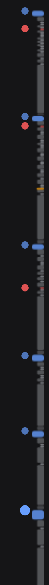

# dsh-strata · 会话地层

[English](README.md) | 中文

**给 DeepSeek Harness Web GUI 的会话轨迹缩略图** —— 它接管对话区原本的滚动条位置，
把整段已加载的会话按真实比例压成一张按事件类型着色的图，你自己的消息重点标出，旁边还有一列可点的锚点。

它不是导航条。别的会话导航插件都是"一条提问一个等距圆点"，而这恰好丢掉了长会话里唯一过剩的信息：
**体量**。这里每个色块的高度是那一行**真实渲染高度**的等比压缩，所以地图就是滚动区的缩影 ——
三百行的回答看起来就是三百行，四十次工具调用看起来就是四十次，视口方框和滚动条 1:1 对应。
一眼就能看出这次跑动的形状：你在哪儿说了话、每一轮花了多少工作量、哪里出了问题。

<p align="center">
  
</p>

## 图上画了什么

| 色块 | 含义 |
|---|---|
| **整宽蓝条** | 你的消息（含插话）—— 永远最宽最亮，最小 5px，绝不消失 |
| 灰色块 | 模型回复，块高就是它写了多少 |
| 细灰刻度 | 一次工具调用 |
| 绿色 | 斜杠命令 |
| 琥珀色 | 模型重试，或被输出上限截断的回合 |
| 红色 | 失败的回合 —— 以及任何报错的工具/命令行 |
| 横线 | 上下文压缩点：模型从这里往上就看不见历史了 |
| 圆角框 | 当前视口（可拖动） |

左边缘的锯齿就是索引：每条蓝杠是你发起的一轮，它下面那坨 agent 工作就是这轮的代价。

## 它替代了滚动条

轨道就落在对话区自己的滚动条槽位里，地图在时原生滑块被抑制 —— 只有一个滚动控件，不是两个；
槽位本来就一直保留，所以没有任何布局抖动。这是接管而不是霸占：地图一旦隐身（轨迹页签、没有会话、
对话根本不滚动），原生滚动条立刻回来；卸载插件则永久还原。

## 锚点

轨道左侧是一列可点的锚点圆点 —— **蓝色是你发过的每一条消息，红色是每一次失败的工具调用或命令**。
点一下就滚过去。当前阅读位置对应的那个点会保持放大，所以锚点同时也是位置指示器。
挨太近的锚点会自动合并以保持这一列清爽；失败锚点永不合并——它通常正是你打开地图的原因。

## 用法

- **点锚点圆点**：跳到那条消息或那次失败。
- **悬停**轨道：轨道变宽，并弹出光标所指那一行的预览卡（类型、你的消息的 `第 n/总数`、行内文本）。
- **点击**色块：滚动到该行并停在阅读位置，落点会闪一下。
- **点空白处或拖动**：像滚动条一样按比例滑动。
- **滚轮**：在轨道上滚动即滚动对话。
- **双击**：钉住展开状态（按浏览器持久化）。
- 历史还没加载完时，轨道顶端出现 **`⌃` 帽子**，点它会触发对话自己的"加载更早"，地图随之延长。

没东西可导航时地图自动隐藏：没有会话、对话根本不滚动、或当前是"轨迹"等非对话视图。

## 安装

```sh
dsh plugin --profile web add "github:jsdvjx/dsh-strata#main"
```

然后重启 `dsh web`。卸载：

```sh
dsh plugin --profile web remove dsh-strata
```

## 实现

纯浏览器半边，Node 半边是空的，不为它走任何会话数据通道。几何和语义都来自对话视图本就公开的锚点 ——
`[data-conversation-scroll]`（滚动容器）、`[data-chat-anchor-key]`（每个流式行）、
`data-chat-flow-kind`（该行注册的 Chat Node 类型）、`data-state="error"`（失败的工具/命令行）、
`[data-composer-seat]`（避开吸底输入框）。它只往全局 `shell.overlay` 列表插槽里加一个条目，
是**加**一个面而不是替换任何面，卸载后原生 UI 分毫不动。滚动条接管走主题自己写明的口子 ——
在滚动容器上把 `--dsh-scrollbar-thumb` 重绑为 `transparent`（ui-sidebar 用的就是这个机制），
WebKit 与 Firefox 两条渲染路径都覆盖，不覆写任何样式表。

渲染走 canvas + rAF：只有对话发生变更或滚动高度变化时才重新量行，纯滚动只移动视口方框 ——
所以流式输出期间不会被地图拖着反复排版。颜色全部读主题自己的 `--dsw-alias-*` token，明暗主题都对；
`prefers-reduced-motion` 下关闭过渡动画。

## 边界

- **地图只覆盖已加载的窗口。** DSH 的历史是按需分页加载的，没加载的部分没有布局可测。顶端的 `⌃`
  就是"上面还有"的诚实提示，也是把它拉进来的最快方式。
- **只作用于对话视图。** "轨迹"页签用的是另一套事件锚点，地图在那里主动隐身，不去猜。
- 轨道占用对话区右侧内边距约 14px 的竖条，这条竖条上的点击会落到地图上。

## 许可

MIT
